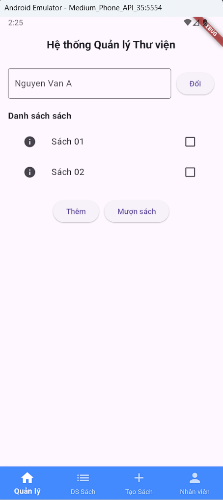
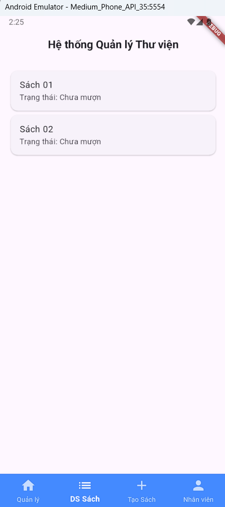
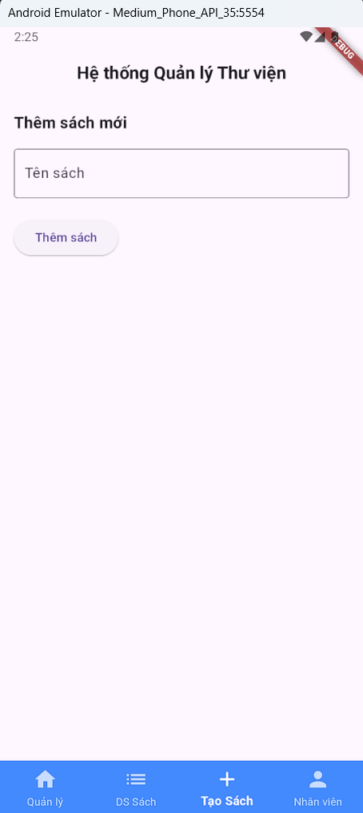
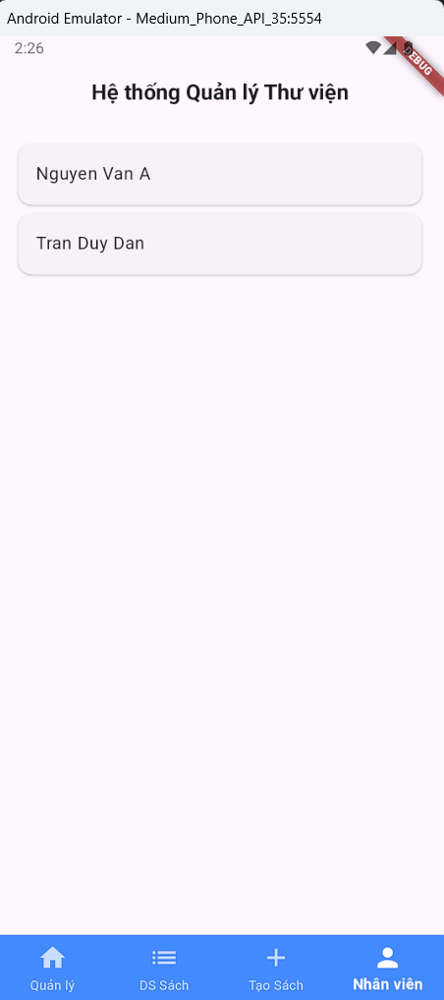

# quanly_thuvien
- Bài tập về xây dựng hệ thống quản lý thư viện:  
cho phép người dùng mượn sách và hiển thị thông tin sách  
=> Tạo danh sách sách  
=> Tạo danh sách người dùng  
=> Cho phép người dùng mượn sách và hiển thị thông tin sách.  

- Cấu trúc của hệ thống được xây dựng như sau:  
lib/  
├── main.dart  
├── models/  
│   ├── library_item.dart  
│   ├── book.dart  
│   └── staff.dart  
├── managers/  
│   └── library_manager.dart  
├── screens/  
│   ├── home_screen.dart  
│   ├── book_list_screen.dart  
│   ├── add_book_screen.dart  
│   └── staff_list_screen.dart  

- Các chức năng chính:  
Quản lý sách: Thêm sách mới, xem danh sách sách, mượn nhiều sách.  
Quản lý nhân viên: Thêm nhân viên mới, xem danh sách nhân viên.  
Quy trình mượn sách: Cho phép chọn nhiều sách bằng checkbox và mượn cho nhân viên.  
Hiển thị thông tin: Xem chi tiết trạng thái và thông tin của từng cuốn sách.  

- Hình ảnh kết quả (output)  
  
  
  

