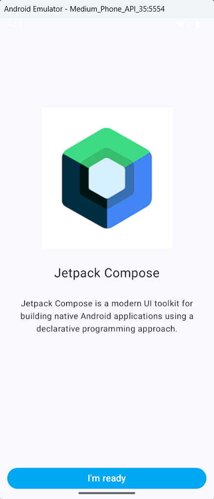
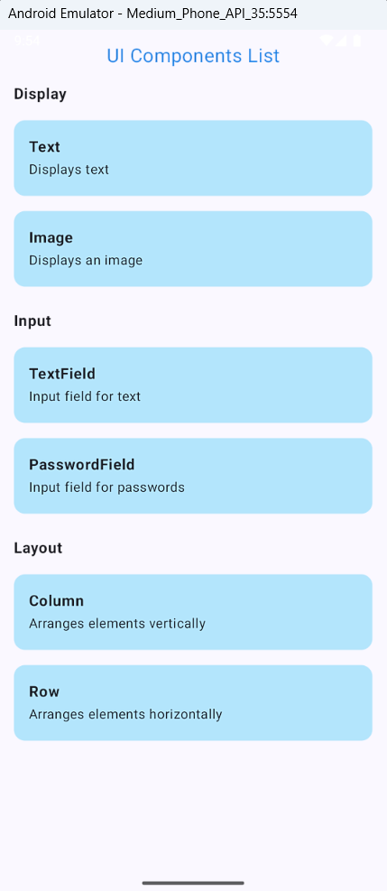
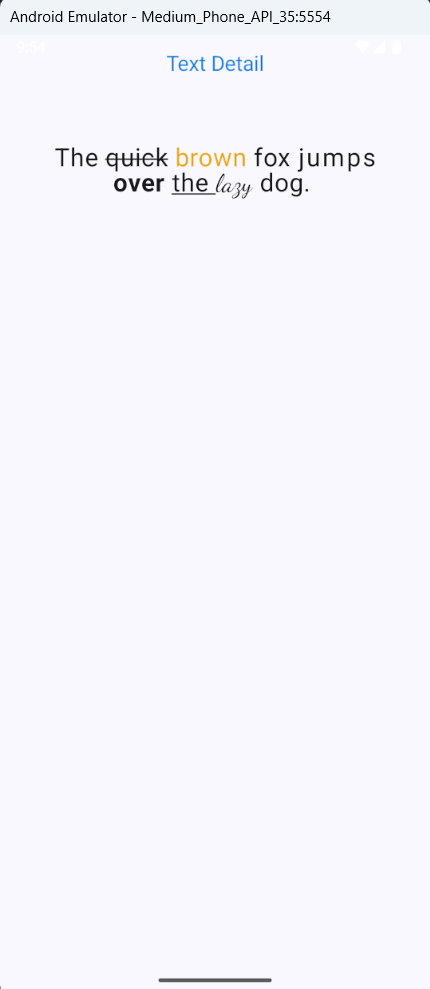
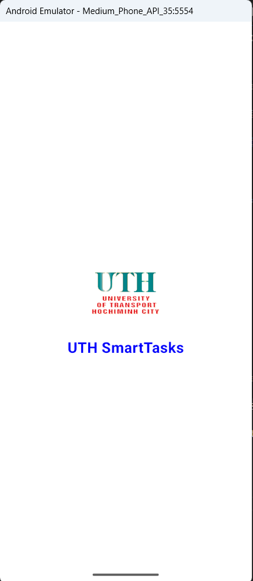
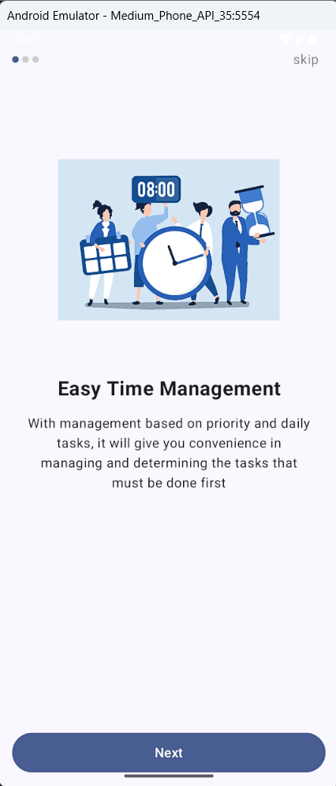
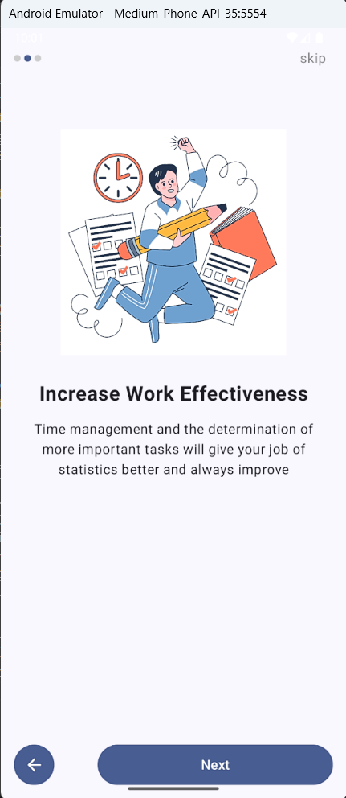
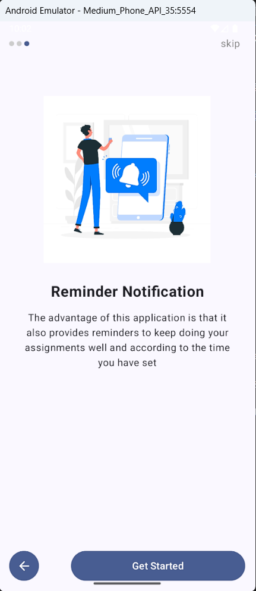

# Bài tập 1: Xây dựng ứng dụng hiển thị đầy đủ các thành phần UI cơ bản.  
- Bài tập này giúp ta sử dụng các thành phần components cơ bản, và hiển thị chúng lên màn hình detail  
  
- Các hàm đã sử dụng trong app:  
  + ComponentsScreen (từ ComponentsScreen.kt): màn hình chính liệt kê nhiều thành phần UI, đóng vai trò là trung tâm điều hướng để xem chi tiết của từng thành phần.
  + ComponentItem (từ ComponentsScreen.kt): Biểu diễn một mục thành phần riêng lẻ dưới dạng thẻ có thể nhấp trong ComponentsScreen. 
  + ComponentDetailScreen (từ ComponentDetailScreen.kt): Hiển thị thông tin chi tiết hoặc ví dụ chức năng cho thành phần được chọn.  
  + SetupNavGraph (từ NavGraph.kt): Thiết lập biểu đồ điều hướng để quản lý chuyển đổi màn hình trong ứng dụng.  
  + MainActivity (từ MainActivity.kt): Điểm đầu vào của ứng dụng, thiết lập giao diện người dùng Compose.

- Kết quả đầu ra (output):
  
  
  

# Bài tập 2: Thiết kế UI và xử lý sự kiện cho Flow OnBoard
- Bài tập này giúp ta thực hành thiết kế UI và xử lý sự kiện khi ấn vào nút (Next, Back và skip)

- Các hàm đã sử dụng trong app:  
  + MainActivity: Khởi tạo ứng dụng, chuyển đổi giữa Splash Screen và Onboarding Screen.  
  + AppNavigation: Quản lý hiển thị Splash Screen và Onboarding Screen.
  + SplashScreen: Hiển thị giao diện Splash Screen.
  + OnboardingScreen: Hiển thị các trang onboarding với dots, nút "Skip", "Back", và "Next".
  + DotsIndicator: Hiển thị các dấu chấm xác định vị trí trang.

- Kết quả đầu ra (output):

