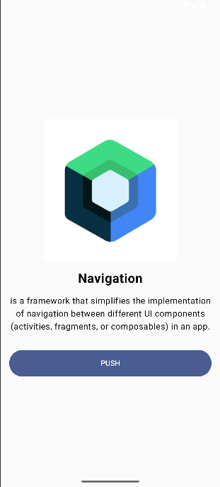
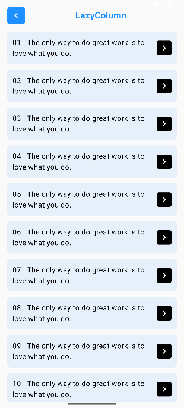
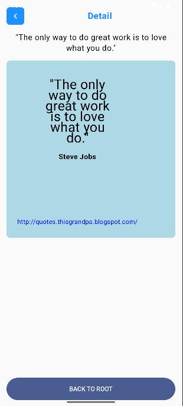

# Bài tập 1: Xây dựng Navigation + LazyColumn
- Bài tập này giúp ta xây dựng app có điều hướng và hiển thị list dưới dạng LazyColumn

- Các hàm đã sử dụng trong app:
 + RootScreen(navController: NavController)
    + Chức năng chính:
        + Hiển thị màn hình chính (Root) của ứng dụng.
        + Cung cấp giao diện giới thiệu đơn giản về "Simple Navigation".
        + Chứa một nút "PUSH" để điều hướng đến màn hình ListScreen.

 + ListScreen(navController: NavController)
    + Chức năng chính:
        + Hiển thị một danh sách cuộn (LazyColumn) với 1 triệu phần tử giống nhau.
        + Mỗi phần tử trong danh sách có thể nhấn để điều hướng đến màn hình DetailScreen.
        + Cung cấp nút quay lại để trở về màn hình trước đó (RootScreen).

 + DetailScreen(navController: NavController)
    + Chức năng chính:
        + Hiển thị màn hình chi tiết với một câu trích dẫn, tên tác giả, và liên kết.
        + Cung cấp nút quay lại để trở về màn hình trước đó (ListScreen) và nút "BACK TO ROOT" để quay về RootScreen.

- Kết quả đầu ra (output):  
  
  

