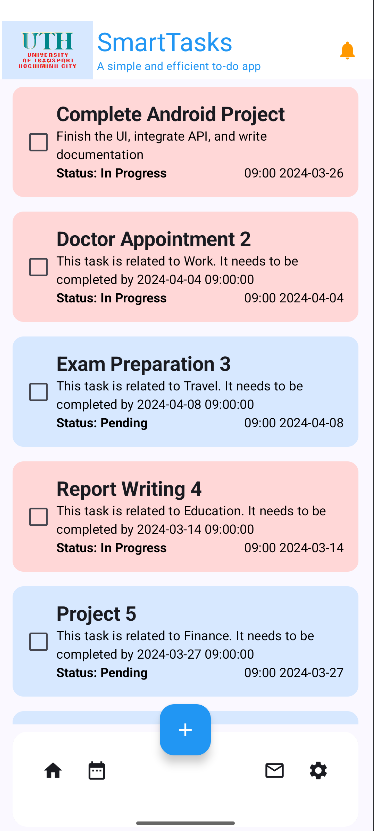
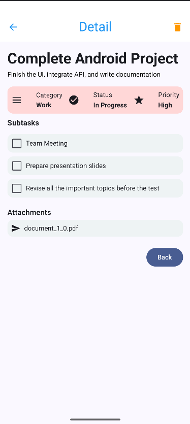
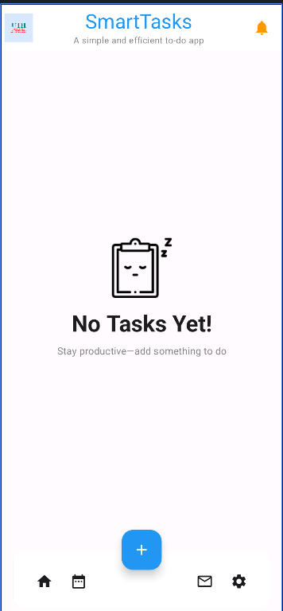

# Bài tập 2: Home Flow - dựng flow trang chủ
- Bài tập giúp ta xây dựng được trang chủ đến các trang chi tiết 1 cách linh hoạt từ bài tập trước đó (App UTH Smart Task)

- Các hàm đã sử dụng:
 + DetailScreen: Hiển thị thông tin chi tiết của task, bao gồm tiêu đề, mô tả, danh mục (category), trạng thái (status), mức độ ưu tiên (priority), subtasks, và attachments.
 + ListScreen: Hiển thị danh sách task, cho phép người dùng nhấn vào task để xem chi tiết, và chuyển hướng nếu danh sách rỗng.
 + ListEmptyScreen: Hiển thị thông báo "No Tasks Yet!" cùng hình minh họa và khuyến khích người dùng thêm task.

- Kết quả đầu ra (output):

