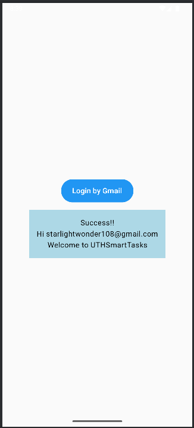

# Bài tập 1: Xây dựng App tích hợp Google FireBase
- Bài tập này giúp ta xây dựng App có tích hợp Firebase để xác minh người dùng đăng nhập.

- Các hàm đã sử dụng trong app:
 + MainActivity.kt: 
   + MainActivity là activity chính, quản lý điều hướng giữa các màn hình và xử lý đăng nhập bằng Google.

 + AuthManager.kt:
   + AuthManager là một ViewModel quản lý logic đăng nhập và trạng thái người dùng.

 + ui/components/LoginButton.kt:
   + LoginButton là composable hiển thị nút "Login by Gmail".

 + ui/components/AuthStatusMessage.kt:
   + 1 composable với mục đích là constructor dành cho việc thông báo xác minh thành công hay thất bại.

 + AuthScreen.kt:
   + Màn hình điều hướng đến trang xác minh thành công hay thất bại.

- Kết quả đầu ra (output):

