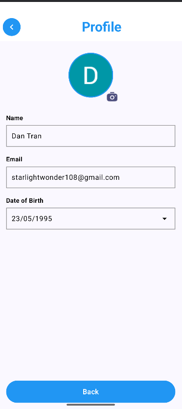

# Bài tập 2: Xây dựng ứng dụng tích hợp Google Firebase để đăng nhập
- Bài tập này giúp ta ứng dụng Firebase vào app để người dùng xác minh và đăng nhập.

- Các hàm đã sử dụng trong app:
    + MainActivity.kt:
        - MainActivity là activity chính, quản lý điều hướng giữa các màn hình và xử lý đăng nhập bằng Google.

    + AuthManager.kt
        - AuthManager là một ViewModel quản lý logic đăng nhập và trạng thái người dùng.

    + ui/LoginScreen.kt
        - LoginScreen là composable hiển thị màn hình đăng nhập.

    + ui/ProfileScreen.kt
        - ProfileScreen là composable hiển thị màn hình hồ sơ người dùng.

    + ui/components/GoogleSignInButton.kt
        - GoogleSignInButton là composable hiển thị nút "SIGN IN WITH GOOGLE".

    + ui/components/BackButton.kt
        - BackButton là composable hiển thị nút "Back".

    + ui/components/ProfileField.kt
        - ProfileField là composable hiển thị các trường thông tin trong màn hình hồ sơ.

- Kết quả đầu ra (output):

