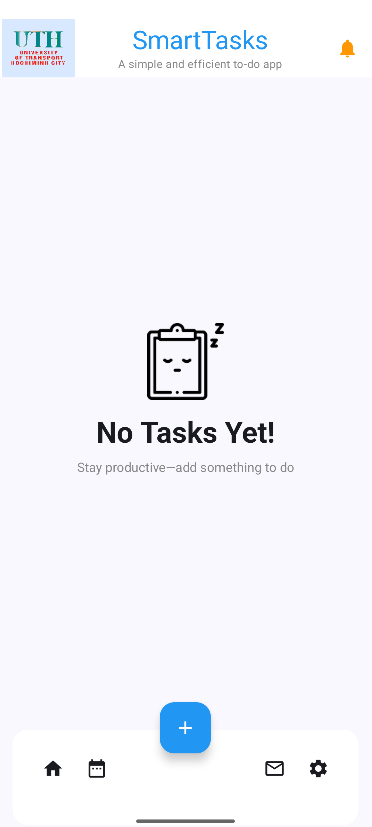
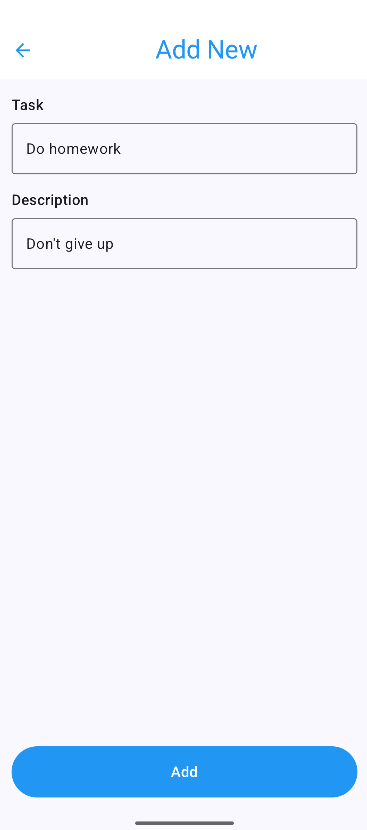
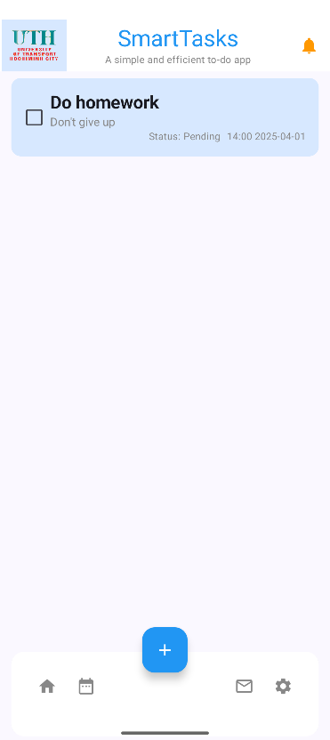

# Bài tập: Phát triển ứng dụng UTHSmartTask
- Bài tập này giúp ta phát triển ứng dụng của bài tập trước (UTHSmartTask) với yêu cầu thêm chức năng Add New list

- Các hàm đã sử dụng trong app: 
 + AddNewScreen.kt:
    - Đây là màn hình chính để thêm task mới, với giao diện gồm các trường nhập liệu và nút "Add".

 + ListScreen.kt
    - Cập nhật để xử lý điều hướng sang AddNewScreen khi nhấn nút "+".

 + ListEmptyScreen.kt
    - Cập nhật để xử lý điều hướng khi danh sách rỗng.

 + MainActivity.kt
    - Cập nhật TaskNavigation để quản lý điều hướng và logic thêm task.

- Kết quả đầu ra (output):  
  
  
  
