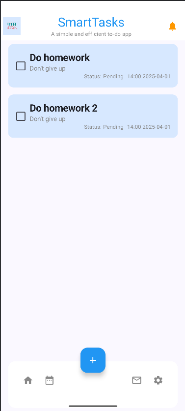

# Bài tập tuần 7: Phát triển ứng dụng UTHSmartTask và sử dụng Room
- Bài tập này giúp ta phát triển ứng dụng UTHSmartTask và sử dụng Room để lưu trữ khi người dùng trong trạng thái offline

- Các hàm đã sử dụng:
    + Điều hướng: NavHost, navigate, popBackStack (Jetpack Navigation Compose).
    + Quản lý trạng thái: StateFlow, collectAsState, LaunchedEffect (Compose, Flow).
    + Quản lý dữ liệu: insertTask, updateTask, deleteTask, getTaskById (Room).
    + Xử lý UI: Các Composable như ListScreen, DetailScreen, AddNewScreen.

- Hình ảnh kết quả (output):  
  
  
  
  
